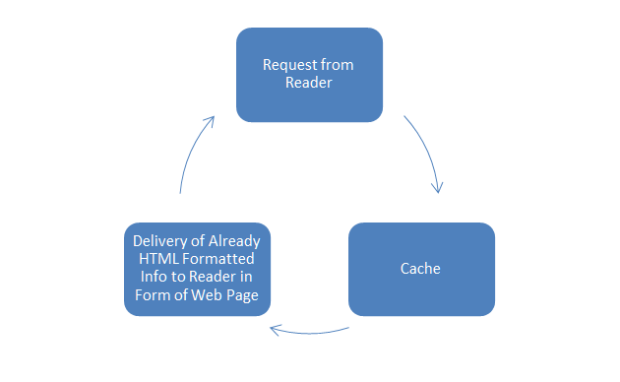

# How Caching Can Speed Up Your WordPress Website

In this article I will explain how you can make use of caching to efficiently optimize and improve the speed of your WordPress website. Now, in order for you to fully appreciate the concept of caching, let us first look at the growing importance of your website’s load speed.

## Importance of a Fast Website

The goal of every business and site owner is to deliver a great user experience. Here are a few factors that are affected by the speed of your website:

### User Retention

Nowadays, because of the increasing reliability in technology performance, web users have come to expect faster page load speeds. When a user visits your site and the overall site performance is low, you risk losing that user. The attention span from the user is increasing getting shorter and shorter, which means just a few seconds can literally make the difference between keeping visitors on your website or driving traffic them away at an alarming rate.
In those few seconds you are able to convince your visitor whether your website is worthy of their valuable time or not. So, if your web site loads faster you have a good chance at retaining the current users as well as impress new visitors. 

### Search Engine Ranking 

There are a lot of factors that go into where your webpage will ultimately appear on the search results page, and page speed serves as one of the many factors that determine search rank. Speed reflects on how quickly a website responds to web requests and a slow website will result in an unsatisfactory user experience. Google started using website speed as a ranking signal in their algorithm in 2010. Quite recently, in 2018, Google announced that they are including page speed as a ranking factor for mobile searches in order to help users find the answers to their questions faster. For official news on crawling and indexing sites for the Google index go to [Google Webmaster Central Blog](https://webmasters.googleblog.com/search/label/speed). 

If your website is running on WordPress, it is important that you focus on choosing a reliable web hosting partner.

> Tip: Check out managed WordPress Hosting because it offers services that are well optimized for speed and efficient performance.

With that said, maintaining a page load score of 80 or better is crucial for reaching the top of the search engine ladder. In order to check your page load score visit [PageSpeed Insights](https://developers.google.com/speed/pagespeed/insights) and type in the URL of the site you want to analyze. 

### Sales and Conversions

For every online business, converting browsers to buyers and visitors to followers is a very important metric. Now, if your site loads slow and it drives people away, then that means it also drives your sales away.

> A test was conducted at Amazon and it revealed that every 100-microsecond increase in load time, translates into a 1 percent decrease in sales. Furthermore, it went on to show that they would potentially lose $1.6 BILLION every year if their website slowed down by just one second.

This research makes it difficult to ignore the need for speed. Therefore, it is extremely important to try to achieve the fastest page load time as much as possible, so that conversion percentages begin to increase and bounce rates to decrease.

### General Web Statistics

The following statistics are from [MOZ](https://moz.com/blog/site-speed-are-you-fast-doesit-matter) and they give a general guideline of how your website load speeds compare to other sites on the web. 

* 5 second load time: faster than 25% of websites
* 2.9 seconds load time: faster than 50% of websites
* 1.7 seconds load time: faster than 75% of websites
* 0.08 seconds load time: faster than 94% of websites

If you want to measure your website’s load speeds you can use any of the following tools [GTmetrix](www.gmetrix.net), [Pingdom](www.pingdom.com) or [Google PageSpeed Insights](https://developers.google.com/speed/pagespeed/insights/). At this point we can now look at what is caching and how it can speed up your WordPress website. 

## What Is Caching 

From its definition, caching is a temporary storage of data that is frequently accessed on a website so as to allow for quick and easy retrieval of that data. By using caching your website can avoid taking longer trips when fetching your data throughout the internet. Instead your site reuses the data from your website that is tapped into on a regular basis in order to save time.

### Caching Basics

The way caching works can be better understood if we first understand what happens when a web user visits your website.

When a user types in your website’s address and presses enter, the user’s browser first requests your web server in for your website.  The WordPress site then contacts the host (which is on some other computer, possibly far, far away) using specialized PHP code. The host then accesses the main database (usually MySQL) where all of your website’s content is stored. This database then takes that request, compiles it into a readable HTML page, and then sends it back to your browser where the user can actively see it. See Diagram.

Now, the problem with this process is that it can potentially take a long time to retrieve the visitor’s information thus slowing down the speed of your website. That is where caching comes into play. Caching provides the temporary storage of data that is tapped into on a regular basis on a website and allows for quicker and easier retrieval cycles. By reusing data from your website that is frequently accessed your site avoids conducting unnecessary round trips throughout the internet to retrieve that information. Caching helps to increase you WordPress site’s speed in several ways, for example by creating static, or unchanging, HTML files and saving them for reuse later. See diagram.

Caching helps to avoid delays in retrieving information to your visitors, decreases server load and lowers the bandwidth used. There are different kinds of Caching but for our purposes, we are going to look at just two: namely Browser and WordPress Caching.

### Browser Caching

In this kind of caching web browsers download HTML files on a given website and keep them in a local cache. When the userrequests to visit the site again, the browser simply enquires from your WordPress server whether the files being requested have changed since they were last downloaded. If the files haven’t been changed, the web browser simply retrieves the information from the local cached copy.
The perfect files to be cached on your site are your basic images, headers, footers, and sidebars because they are static, which means the usually remain unchanged. Browser Caching will help to decrease your site’s load time and reduce the overall burden on your server by reducing the number of requests per page.

### WordPress Caching

This type of caching uses a caching plugin which is configured on your WordPress server. Essentially, when using a caching plugin, HTML pages are saved entirely in the cache where they are already constructed and quickly deliverable rather than trying to retrieve parts of the website stored on different parts in the main database.
There are different ways in which you can customize your chosen plugin to meet your site’s requirements. An example would be to configure the caching plugin to save popular query results on you site such as “About Us” and “Contact” pages. That way when a user visits your site, the cache holds the results of these queries and provides them to the reader quickly and efficiently.
Caching works for dynamic, or ever-changing files as well. Using your caching plugin, there is an option to set an expiration date which tells your cache storage that for that set amount of time e.g. 1 week that particular file will remain unchanged, therefore it is safe to cache and use for future requests. In this way your cache can refresh itself after the expiration date passes and update its contents; displaying the new and relevant information as quickly as possible to your users. 
There are several different choices when it comes to deciding which caching plugin to use on your WordPress site. We will now take a look at a few popular caching plugins for WordPress.

## Wordpress Caching Plugins

### WP Rocket

WP Rocket is one of the most popular premium caching plugins for WordPress websites. This plugin can greatly increase the speed of your website and it delivers great results with very little effort. WP Rocket simplifies enabling and managing caching for WordPress websites through its user-friendly dashboard. As soon as you activate the plugin it will start caching your site to improve loading times. WP Rocket is compatible with most content delivery network (CDN) providers which effectively speed up your website. It comes with a lot of built-in features for media and database optimization as large files and records can potentially slow down your website. 

To test the plugin's performance, WP Rocket was installed on three sites, and all of them saw increases in speed, ranging from an improvement of 27 to 69 percent. Full details of the tests can be seen at [WP Rocket Plugin Review](https://winningwp.com/wp-rocket-wordpress-plugin-review/)

For more information about WP Rocket visit [WP Rocket](http://wp-rocket.me/)

### W3 Total Cache 

W3Total Cache plugin is one of the most popular free caching plugins for WordPress. It has over a million active installs and a user review rating of 4.3 out of 5 stars.  It is frequently updated and is used many major sites such as Mashable, GoDaddy, and AT&T. It caches browsers, pages, objects, databases, feeds, search results, and much more. You can easily set expiration dates for each type of caching your website employs. Beginners may find W3 Total Cache a bit difficult to use because it has 16 individual pages of configuration choices but luckily, its default settings are fairly optimal and easy to access. For more information about this plugin visit [W3 Total Cache plugin](https://wordpress.org/plugins/w3-total-cache/)

## WP Super Cache 

WP Super Cache is a highly popular free caching plugin for WordPress. WP Super Cache has over two million active installs and a user rating of 4.2 out of 5 stars. The plugin decreases load times and can improve the speed of your website. It is highly effective at keeping your server from slowing or even overloading during the large traffic surges that can occur when you site is popular. This has a lot of customization options plugin but however the recommended settings are easy to configure and set up. For more information about this plugin visit [WP Super Cache Plugin](https://wordpress.org/plugins/wp-super-cache/)

## Conclusion

A comparison between WP Rocket with two of the most popular free WordPress caching plugins (WP Super Cache and W3 Total Cache), revealed that WP Rocket delivered the best results based on the test data.  WP Rocket is definitely worth investing in if you are looking for a solution that can be used to speed up a website with very little effort and no technical knowledge required. 

Other note-worthy caching plugins for WordPress include: [WP Fastest Cache](https://wordpress.org/plugins/wp-fastest-cache/),  [Hyper Cache](https://wordpress.org/plugins/hyper-cache/), [Comet Cache](https://wordpress.org/plugins/comet-cache/),  [Cachify](https://wordpress.org/plugins/cachify/),  [Simple Cache](https://wordpress.org/plugins/simple-cache/). 

**Note:** You can use tools like [GTmetrix](www.gmetrix.net), [Pingdom](www.pingdom.com) or [Google PageSpeed Insights](https://developers.google.com/speed/pagespeed/insights/) to conduct your own tests and measure the improvement in speed a caching plugin can give you. 

## References

* WordPress Plugins - [WordPress Website](https://wordpress.org/plugins/)

